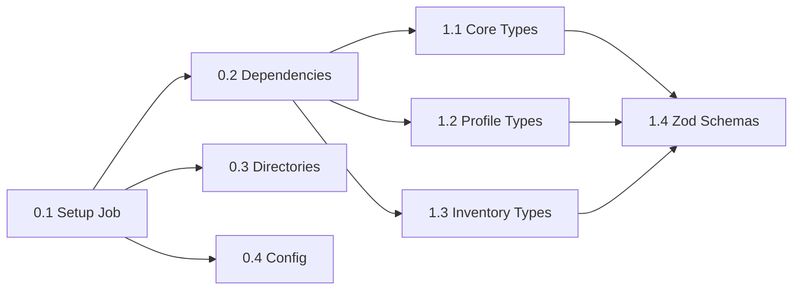
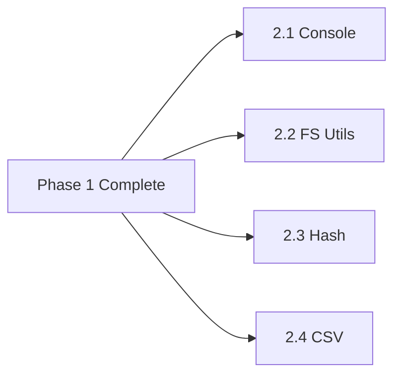
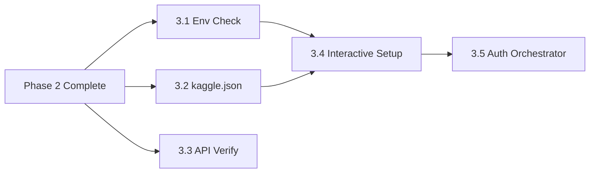
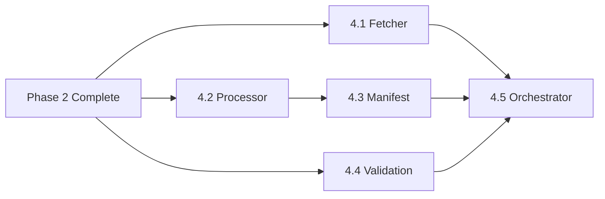
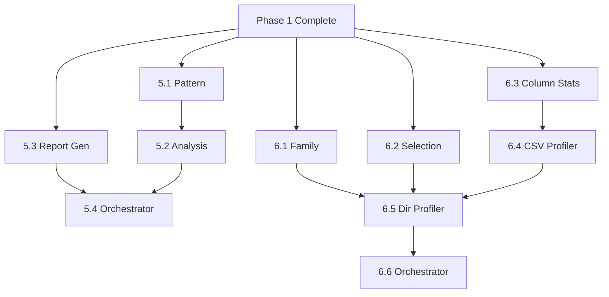
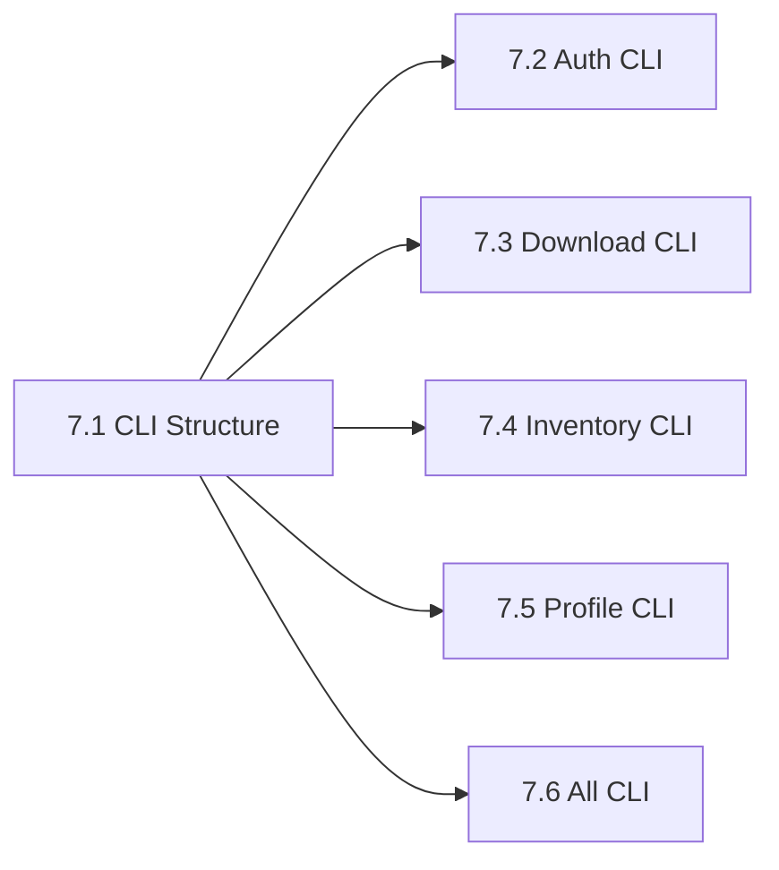

# Time-Saving Tools (Claude Code)

This guide lists Claude Code plugins/skills and MCP integrations that speed up common tasks in this Nx + pnpm + TypeScript backend. Formerly PARALLELS.md; now focused solely on practical accelerators.

## Claude Code Plugins & Skills (GitHub)

- greggh/claude-code.nvim — Neovim bridge for Claude Code. Try: “Run just test and summarize failures,” or “Refactor services/api-gateway/src/app/\* for route naming.”
  Link: https://github.com/greggh/claude-code.nvim

- samir-roy/code-bridge.nvim — Alternative Neovim integration with chat-in-editor for quick edits and reviews.
  Link: https://github.com/samir-roy/code-bridge.nvim

- udecode/dotai — Context manager for Claude/Cursor. Load `ARCHITECTURE.md`, `nx.json`, and `services/**/project.json` so Claude preserves Nx topology during refactors.
  Link: https://github.com/udecode/dotai

- obra/superpowers + superpowers-skills — Skill packs to run shell-like operations safely. Map skills to: `just gen-service <name>`, `just gen-lib <name>`, `pnpm nx affected -t test`, `pnpm nx graph`.
  Links: https://github.com/obra/superpowers • https://github.com/obra/superpowers-skills

- croffasia/cc-blueprint-toolkit — Blueprint-driven scaffolding. Mirror `scripts/gen-*.sh` to standardize service/lib creation with prompts and guardrails.
  Link: https://github.com/croffasia/cc-blueprint-toolkit

- gwendall/superclaude — Draft Conventional Commit messages and PR descriptions from diffs. Useful with our Husky commit-msg hook.
  Link: https://github.com/gwendall/superclaude

## GitHub MCP (Model Context Protocol)

- Automate repo tasks from chat: create issues/PRs, comment, search code, and check PR status.
- Examples:
  - “Create issue: flaky worker test when env missing.”
  - “Open PR: chore(shared): bump thresholds doc in vitest config.”
  - “Search code for fastify register in api-gateway.”

## Usage Notes

- Install via Claude Code Plugin Marketplace or “Add from URL”.
- Keep prompts anchored to repo commands for determinism: `just check`, `pnpm nx affected -t test`, `pnpm nx build <project>`.
- Never paste real secrets. Use `.env.example` and `docker compose` for local infra.

## AI Agents TL;DR

- Setup once: `pnpm install`, `cp .env.example .env`, `docker compose up -d` (optional), then `pnpm dev`.
- Work in small, vertical slices. Write tests first, then implement. Use `pnpm nx affected -t test,build,lint` to stay fast.
- Use GitHub MCP to create branches, open PRs, and comment on diffs programmatically. Follow Conventional Commits.
- Batch similar tasks per phase to avoid context switching (e.g., write all utils tests, then implement them together).
- Automate early: set up coverage, hooks, and CI tasks from the start so quality checks run continuously.
- Ignore team/parallelization guidance below; it’s kept for reference only.

## Agent Plan

- Foundation (Phases 0–2): setup/deps/dirs/config → types → Zod schemas → utilities (batch tests then implement)
- Core Features (Phases 3–6): auth → download → inventory + profiling → orchestrators
- Integration & Polish (Phases 7–10): CLI (thin wrappers) → enhanced tests → docs → CI validation → PRs merged

## Daily Agent Runbook

- Start: `pnpm nx affected -t test,build,lint` (fast sanity). Optionally `pnpm nx graph --focus` to visualize.
- Choose one small slice; write failing tests; implement; make tests pass.
- Keep docs current while coding (JSDoc + small README updates).
- Commit with Conventional Commits; open PRs via GitHub MCP (include problem statement, summary, test notes).
- End: `pnpm affected:test` for coverage and `pnpm nx build <project>` for any changed projects.

## Go-To Commands (Agents)

- Dev: `pnpm dev`, `pnpm nx serve <project>`
- Tests: `pnpm test`, `pnpm nx test <project> --watch`, `pnpm affected:test`
- Build: `pnpm nx build <project>`, `pnpm affected:build`
- Lint/Format: `pnpm lint`, `pnpm format`
- Graph: `pnpm nx graph` (add `--focus=<project>` to narrow scope)
- CI-like local gate: `just check` (or `pnpm lint && pnpm test && pnpm nx build <affected>`)

Note: The sections below include parallelization ideas; team-only content has been removed.

- [Critical Path](#critical-path)
- [Parallel Work Streams](#parallel-work-streams)
- [Phase-by-Phase Breakdown](#phase-by-phase-breakdown)
- [Dependency Graph](#dependency-graph)
- [Quick Wins](#quick-wins)
- [Optimization Tips](#optimization-tips)
- [MCP Command Snippets](#mcp-command-snippets)

---

## Critical Path

**The Critical Path** is the longest sequence of dependent tasks that must be completed sequentially. This determines the minimum possible timeline.

### Sequential Dependencies (Cannot Parallelize):

```
Phase 0.1 (Setup Job)
  ↓
Phase 0.2 (Install Dependencies)
  ↓
Phase 1.1-1.3 (Define Types) → Phase 1.4 (Create Zod Schemas)
  ↓
Phase 2.* (Build Utils in parallel, BUT...)
  ↓
Phase 3.5 (Auth Orchestrator) ← depends on 3.1-3.4
  ↓
Phase 4.5 (Download Orchestrator) ← depends on 4.1-4.4
  ↓
Phase 5.4 (Inventory Orchestrator) ← depends on 5.1-5.3
  ↓
Phase 6.6 (Profile Orchestrator) ← depends on 6.1-6.5
  ↓
Phase 7.* (CLI can be parallel, but needs lib functions)
  ↓
Phase 8-10 (Testing, Docs, CI/CD)
```

<!-- Time estimates removed by request -->

---

## Parallel Work Streams

### 🎯 Stream 1: Core Infrastructure (Priority: HIGH)

| Task                       | Dependencies | Can Start After                   |
| -------------------------- | ------------ | --------------------------------- |
| 0.1 - Create Job Structure | None         | Immediately                       |
| 0.2 - Setup Dependencies   | 0.1          | After 0.1                         |
| 0.3 - Create Directories   | 0.1          | After 0.1 (parallel with 0.2)     |
| 0.4 - Config Files         | 0.1          | After 0.1 (parallel with 0.2-0.3) |

---

### 🎯 Stream 2: Type System (Priority: HIGH)

| Task                  | Dependencies  | Can Start After | Parallel With |
| --------------------- | ------------- | --------------- | ------------- |
| 1.1 - Core Types      | Phase 0       | After Phase 0   | 1.2, 1.3      |
| 1.2 - Profile Types   | Phase 0       | After Phase 0   | 1.1, 1.3      |
| 1.3 - Inventory Types | Phase 0       | After Phase 0   | 1.1, 1.2      |
| 1.4 - Zod Schemas     | 1.1, 1.2, 1.3 | After 1.1-1.3   | -             |

**💡 Optimization**: All three type files (1.1, 1.2, 1.3) can be created simultaneously!

---

### 🎯 Stream 3: Utility Functions (Priority: HIGH)

**✅ FULLY INDEPENDENT - Can ALL be done in parallel!**

| Task                    | Dependencies | Parallel With |
| ----------------------- | ------------ | ------------- |
| 2.1 - Console Utils     | Phase 1      | 2.2, 2.3, 2.4 |
| 2.2 - File System Utils | Phase 1      | 2.1, 2.3, 2.4 |
| 2.3 - Hash Utils        | Phase 1      | 2.1, 2.2, 2.4 |
| 2.4 - CSV Utils         | Phase 1      | 2.1, 2.2, 2.3 |

<!-- Total duration removed -->

**💡 Optimization**: Perfect for team sprint - each dev takes one utility module.

---

### 🎯 Stream 4: Authentication (Priority: HIGH)

| Task                    | Dependencies     | Parallel With |
| ----------------------- | ---------------- | ------------- |
| 3.1 - Env Check         | Phase 2          | 3.2, 3.3      |
| 3.2 - kaggle.json Check | Phase 2 (2.2 FS) | 3.1, 3.3      |
| 3.3 - API Verification  | Phase 2          | 3.1, 3.2      |
| 3.4 - Interactive Setup | 3.1, 3.2, 2.2    | -             |
| 3.5 - Auth Orchestrator | 3.1-3.4          | -             |

<!-- Total duration removed -->

**💡 Optimization**: 3.1, 3.2, 3.3 can all be developed simultaneously.

---

### 🎯 Stream 5: Download System (Priority: HIGH)

| Task                        | Dependencies       | Parallel With |
| --------------------------- | ------------------ | ------------- |
| 4.1 - Dataset Fetcher       | Phase 2            | 4.2, 4.4      |
| 4.2 - File Processing       | Phase 2 (2.3, 2.4) | 4.1, 4.4      |
| 4.3 - Manifest Creation     | 4.2, Phase 1.4     | 4.4           |
| 4.4 - Validation            | Phase 2, Phase 1   | 4.1, 4.2      |
| 4.5 - Download Orchestrator | 4.1-4.4            | -             |

<!-- Total duration removed -->

**💡 Optimization**: 4.1 (fetcher), 4.2 (processing), and 4.4 (validation) can be developed in parallel.

---

### 🎯 Stream 6: Inventory Analysis (Priority: MEDIUM)

| Task                         | Dependencies | Parallel With |
| ---------------------------- | ------------ | ------------- |
| 5.1 - Pattern Extraction     | Phase 1      | 5.3           |
| 5.2 - Directory Analysis     | 5.1, Phase 1 | 5.3           |
| 5.3 - Report Generation      | Phase 1      | 5.1           |
| 5.4 - Inventory Orchestrator | 5.1-5.3      | -             |

<!-- Total duration removed -->

**💡 Optimization**: 5.1 and 5.3 are independent and can be done in parallel.

---

### 🎯 Stream 7: Schema Profiling (Priority: MEDIUM)

| Task                       | Dependencies   | Parallel With |
| -------------------------- | -------------- | ------------- |
| 6.1 - Family Detection     | Phase 1        | 6.2, 6.3      |
| 6.2 - File Selection       | Phase 1        | 6.1, 6.3      |
| 6.3 - Column Summarization | Phase 1        | 6.1, 6.2      |
| 6.4 - CSV Profiler         | 6.3, Phase 2.4 | -             |
| 6.5 - Directory Profiler   | 6.1, 6.2, 6.4  | -             |
| 6.6 - Profile Orchestrator | 6.1-6.5        | -             |

<!-- Total duration removed -->

**💡 Optimization**: 6.1, 6.2, 6.3 can all be developed simultaneously.

---

### 🎯 Stream 8: CLI Interface (Priority: MEDIUM)

**✅ FULLY INDEPENDENT - Can ALL be done in parallel (once lib functions exist)!**

| Task                     | Dependencies    | Parallel With      |
| ------------------------ | --------------- | ------------------ |
| 7.1 - CLI Structure      | Phase 0         | -                  |
| 7.2 - Auth Command       | 7.1, Phase 3.5  | 7.3, 7.4, 7.5, 7.6 |
| 7.3 - Download Command   | 7.1, Phase 4.5  | 7.2, 7.4, 7.5, 7.6 |
| 7.4 - Inventory Command  | 7.1, Phase 5.4  | 7.2, 7.3, 7.5, 7.6 |
| 7.5 - Profile Command    | 7.1, Phase 6.6  | 7.2, 7.3, 7.4, 7.6 |
| 7.6 - All-in-One Command | 7.1, Phases 3-6 | 7.2, 7.3, 7.4, 7.5 |

<!-- Total duration removed -->

**💡 Optimization**: All CLI commands are thin wrappers - can be split across team.

---

### 🎯 Stream 9: Enhanced Testing (Priority: LOW-MEDIUM)

**✅ Can be done THROUGHOUT development (TDD approach)**

| Task                    | Dependencies | Notes                    |
| ----------------------- | ------------ | ------------------------ |
| 8.1 - Edge Case Tests   | Phases 3-6   | Add as features complete |
| 8.2 - Integration Tests | Phases 3-6   | Add after orchestrators  |
| 8.3 - Performance Tests | Phases 2-6   | Can be added anytime     |
| 8.4 - Coverage Setup    | Phase 0      | Can be done early        |

<!-- Total duration removed -->

**💡 Optimization**: Set up coverage (8.4) immediately after Phase 0. Add tests continuously.

---

### 🎯 Stream 10: Documentation (Priority: LOW)

**✅ Can be done THROUGHOUT development**

| Task                     | Dependencies       | Notes          |
| ------------------------ | ------------------ | -------------- |
| 9.1 - JSDoc Comments     | As code is written | Continuous     |
| 9.2 - README             | Phase 7            | Near end       |
| 9.3 - Type Documentation | Phase 1            | Can be early   |
| 9.4 - Migration Guide    | All phases         | End of project |

<!-- Total duration removed -->

**💡 Optimization**: Write JSDoc comments as you implement each function (part of TDD).

---

### 🎯 Stream 11: CI/CD (Priority: MEDIUM)

| Task                    | Dependencies | Notes             |
| ----------------------- | ------------ | ----------------- |
| 10.1 - Build Targets    | Phase 0      | Can be done early |
| 10.2 - Pre-commit Hooks | Phase 0      | Can be done early |
| 10.3 - Validation Suite | All phases   | End of project    |
| 10.4 - Code Review      | All phases   | End of project    |

<!-- Total duration removed -->

**💡 Optimization**: Set up build targets and hooks (10.1, 10.2) immediately after Phase 0.

---

## Phase-by-Phase Breakdown

### Foundation (Phases 0-2)

#### Setup & Types



**Parallel Tasks**:

- 0.2, 0.3, 0.4 (after 0.1)
- 1.1, 1.2, 1.3 (all parallel)

---

#### Utilities



**Parallel Tasks**:

- ALL Phase 2 tasks can run simultaneously

<!-- Timelines removed -->

---

### Core Features (Phases 3-6)

#### Authentication



**Parallel Tasks**:

- 3.1, 3.2, 3.3 all parallel

<!-- Timelines removed -->

---

#### Download System



**Parallel Tasks**:

- 4.1, 4.2, 4.4 all parallel

<!-- Timelines removed -->

---

#### Inventory & Profiling



**Parallel Tasks**:

- Inventory: 5.1 and 5.3 parallel
- Profile: 6.1, 6.2, 6.3 all parallel
- **Phases 5 and 6 can be developed concurrently by different devs!**

<!-- Timelines removed -->

---

### Integration & Polish (Phases 7-10)

#### CLI & Testing



**Parallel Tasks**:

- ALL CLI commands (7.2-7.6) can be parallel

<!-- Timelines removed -->

---

#### Documentation & CI/CD

- Write README, migration guide
- Final testing and validation
- Code review

<!-- Timeline removed -->

---

<!-- Team allocation strategies removed for AI agent focus -->

**💡 Agent Optimization Tips**:

1. **Batch similar work**: Write all tests for a phase together, then implement
2. **Use pomodoro**: 2-3 focused tasks per phase in parallel mental mode
3. **Set up automation early**: CI/CD, coverage, linting from the start
4. **Document as you go**: JSDoc comments while implementing (TDD)

---

## Dependency Graph

### High-Level Phase Dependencies

```
Phase 0 (Setup)
  ↓
Phase 1 (Types) ← Can start some tasks in parallel
  ↓
Phase 2 (Utils) ← All tasks fully parallel
  ↓
├─ Phase 3 (Auth)    ← Some tasks parallel
├─ Phase 4 (Download) ← Some tasks parallel
├─ Phase 5 (Inventory) ← Some tasks parallel
└─ Phase 6 (Profile)   ← Some tasks parallel
  ↓
Phase 7 (CLI) ← All commands parallel
  ↓
├─ Phase 8 (Testing) ← Continuous throughout
├─ Phase 9 (Docs)    ← Continuous throughout
└─ Phase 10 (CI/CD)  ← Some early, some late
```

### Detailed Task Dependencies

```
Legend:
→ Sequential dependency (must wait)
⇉ Parallel possibility (can overlap)

0.1 → 0.2
    → 0.3
    → 0.4

0.2 → 1.1 ⇉ 1.2 ⇉ 1.3 → 1.4

1.4 → 2.1 ⇉ 2.2 ⇉ 2.3 ⇉ 2.4

2.* → 3.1 ⇉ 3.2 ⇉ 3.3 → 3.4 → 3.5

2.* → 4.1 ⇉ 4.2 ⇉ 4.4 → 4.5
      4.2 → 4.3 → 4.5

1.* → 5.1 ⇉ 5.3
      5.1 → 5.2
      5.2, 5.3 → 5.4

1.* → 6.1 ⇉ 6.2 ⇉ 6.3 → 6.4 → 6.5 → 6.6

7.1 → 7.2 ⇉ 7.3 ⇉ 7.4 ⇉ 7.5 ⇉ 7.6

Continuous: 8.*, 9.*, 10.1, 10.2
Final: 10.3, 10.4
```

---

## Quick Wins

**Tasks that can be completed quickly and independently**:

### ⚡ Early Quick Wins (After Phase 0)

1. **Phase 0.4** - Config file - Just TypeScript constants
2. **Phase 8.4** - Coverage setup - Configure vitest
3. **Phase 10.1** - Build targets - Nx configuration
4. **Phase 10.2** - Pre-commit hooks - Configure lint-staged

### ⚡ Quick Wins (After Phase 1)

1. **Phase 2.1** - Console utils - Simple formatting functions
2. **Phase 9.3** - Type documentation - Add JSDoc comments to types
3. **Phase 1.4** - Zod schemas - Mirror TypeScript types

### ⚡ Quick Wins (After Core Features)

1. **Phase 5.1** - Pattern extraction - Pure regex function
2. **Phase 6.1** - Family detection - Pure pattern matching
3. **Phase 6.2** - File selection - Pure sorting logic

### ⚡ Quick Wins (After Orchestrators)

1. **All CLI commands** (7.2-7.6) - Thin wrappers
2. **Phase 9.2** - README - Documentation

**💡 Strategy**: Knock out quick wins at the end of each work session for momentum.

---

## Optimization Tips

### 🚀 Maximize Parallelization

#### 1. **Use Git Worktrees for Parallel Development** ⚡

**What are Git Worktrees?**
Git worktrees allow you to check out multiple branches simultaneously in different directories, all linked to the same repository. Perfect for parallel development!

**Setup**:

```bash
# Main working directory (e.g., on main branch)
cd /Users/max/super-zol/backend

# Create worktrees for parallel work streams
git worktree add ../super-zol-phase2-utils feature/phase-2-utils
git worktree add ../super-zol-phase3-auth feature/phase-3-auth
git worktree add ../super-zol-phase4-download feature/phase-4-download

# Each worktree is a separate directory
ls -la ../ | grep super-zol
# super-zol/              (main - your primary workspace)
# super-zol-phase2-utils/ (feature/phase-2-utils branch)
# super-zol-phase3-auth/  (feature/phase-3-auth branch)
# super-zol-phase4-download/ (feature/phase-4-download branch)
```

**Workflow**:

```bash
# Terminal 1: Work on utils
cd ../super-zol-phase2-utils/jobs/fetch-kaggle
pnpm nx test fetch-kaggle --testPathPattern=utils --watch

# Terminal 2: Work on auth (simultaneously!)
cd ../super-zol-phase3-auth/jobs/fetch-kaggle
pnpm nx test fetch-kaggle --testPathPattern=auth --watch

# Terminal 3: Work on download (simultaneously!)
cd ../super-zol-phase4-download/jobs/fetch-kaggle
# ... your work here

# When done, merge each branch independently
cd /Users/max/super-zol/backend
git checkout main
git merge feature/phase-2-utils
git merge feature/phase-3-auth
git merge feature/phase-4-download

# Clean up worktrees
git worktree remove ../super-zol-phase2-utils
git worktree remove ../super-zol-phase3-auth
git worktree remove ../super-zol-phase4-download
```

**Benefits**:

- ✅ No branch switching - each worktree stays on its branch
- ✅ Run tests in parallel across worktrees
- ✅ Compare implementations side-by-side
- ✅ No context switching overhead
- ✅ Each worktree has its own `node_modules` (isolated dependencies)
- ✅ Perfect for AI agents doing parallel work

**Use Cases**:

- **AI Agent**: Work on Phase 2 utils in one terminal, Phase 3 auth in another
- **Comparison**: Keep Python version in one worktree, TS version in another for validation

**Example Agent Workflow**:

```bash
# Morning: Set up parallel work
git worktree add ../fetch-kaggle-utils feature/utils
git worktree add ../fetch-kaggle-auth feature/auth

# Work on utils (TDD: write all tests)
cd ../fetch-kaggle-utils
# Write all util tests...

# Switch to auth (TDD: write all tests)
cd ../fetch-kaggle-auth
# Write all auth tests...

# Afternoon: Implement in parallel
cd ../fetch-kaggle-utils
# Implement utils while tests run in watch mode...

cd ../fetch-kaggle-auth
# Implement auth while tests run in watch mode...

# Evening: Merge both
cd /Users/max/super-zol/backend
git merge feature/utils
git merge feature/auth
```

---

#### 2. **Use Feature Branches Aggressively**

```bash
# Each parallel task gets its own branch
git checkout -b feature/phase-2-console-utils
git checkout -b feature/phase-2-hash-utils
git checkout -b feature/phase-2-csv-utils
```

**Benefit**: Isolate parallel tasks cleanly; merge when ready.

---

#### 3. **Batch Similar Work (Agents)**

Instead of:

```
❌ Test → Implement → Test → Implement (context switching)
```

Do this:

```
✅ Write all tests for Phase 2 → Implement all Phase 2 functions
```

**Benefit**: Reduces context switching, maintains flow state.

---

#### 4. **Setup Automation Early**

- Configure CI/CD, coverage, pre-commit hooks early
- **Benefit**: Catch issues early, maintain quality throughout

---

#### 5. **Use Stubs for Parallel Development**

When a later task depends on a function not yet implemented:

```typescript
// Create a stub immediately
export async function ensureKaggleAuth(): Promise<boolean> {
  throw new Error('TODO: Implement');
}
```

**Benefit**: Unblocks downstream work; integrate the real implementation later.

---

#### 7. **Continuous Testing**

Don't wait until Phase 8 for testing:

```
Phase 2: Write utils → Write tests (TDD)
Phase 3: Write auth → Write tests (TDD)
Phase 8: Add EDGE CASE tests
```

**Benefit**: Catch bugs early, Phase 8 is just enhancements.

---

#### 8. **Documentation as You Code**

````typescript
/**
 * Calculate SHA256 checksum for a file.
 *
 * @param filePath - Absolute path to file
 * @param options - Optional progress callback
 * @returns Hex-encoded SHA256 digest
 *
 * @example
 * ```ts
 * const hash = await calculateSHA256('/path/to/file.csv');
 * console.log(hash); // "a1b2c3..."
 * ```
 */
export async function calculateSHA256(
  filePath: string,
  options?: { onProgress?: (bytes: number) => void }
): Promise<string> {
  // Implementation
}
````

**Benefit**: Phase 9.1 is already 80% complete when you reach it.

---

<!-- Timeline optimization section removed by request -->

---

## Summary

### 🎯 Key Takeaways

1. **Phase 2 (Utils)** is the most parallelizable - 4 completely independent modules
2. **Phase 7 (CLI)** is also highly parallel - 5 independent commands
3. **Phases 5 & 6** can run as separate tracks concurrently
4. **Testing & Docs** should be continuous, not end-loaded
5. **Setup CI/CD early** (Phase 0) to maintain quality throughout

<!-- Parallelization timing table removed by request -->

### 🏆 Recommended Approach

**For AI Agents**:

- Follow the Agent Plan above
- Batch similar work (all tests, then all implementations)
- Knock out quick wins for momentum
- Set up automation early

---

## MCP Command Snippets

- Create branch
  - “Create branch feature/phase-2-csv-utils from main.”

- Push files to a branch (single commit)
  - “Push files to feature/phase-2-csv-utils with message 'feat(csv): add csv utils':
    - path: libs/csv-utils/src/index.ts (paste content)
    - path: libs/csv-utils/tests/index.test.ts (paste content)
      Then report the commit SHA.”

- Open pull request
  - “Open PR to main from feature/phase-2-csv-utils titled: feat(csv): add csv utils.
    Body: follow .github/PULL_REQUEST_TEMPLATE.md (Problem Statement, Summary, Tests + Coverage, Docs Updates).
    Labels: type:feat, area:csv, status:ready-for-review.”

- Comment on a PR (review notes)
  - “Add PR comment: Please add edge-case tests for empty rows and malformed CSV headers.”

- Update PR branch
  - “Update PR #<number> with latest from main.”

- Create issue
  - “Create issue: flaky CSV profiler test when file has BOM. Label: bug, area:csv.”

- Search code
  - “Search code for registerFastify or fastify routes in services/api-gateway.”

Notes

- Use Conventional Commits in titles (e.g., feat, fix, chore).
- Keep changes scoped to Nx projects; prefer `libs/` for shared logic.
- Before opening PRs, ensure local gate is green: `pnpm nx affected -t test,build,lint`.

**Next Steps**:

1. Review TODO.md phases
2. Finalize agent plan and create feature branches for parallel work
3. Set up CI/CD early (Phase 10.1-10.2)
4. Start with Phase 0 → Phase 1 → Phase 2 (batched)

Good luck! 🚀
