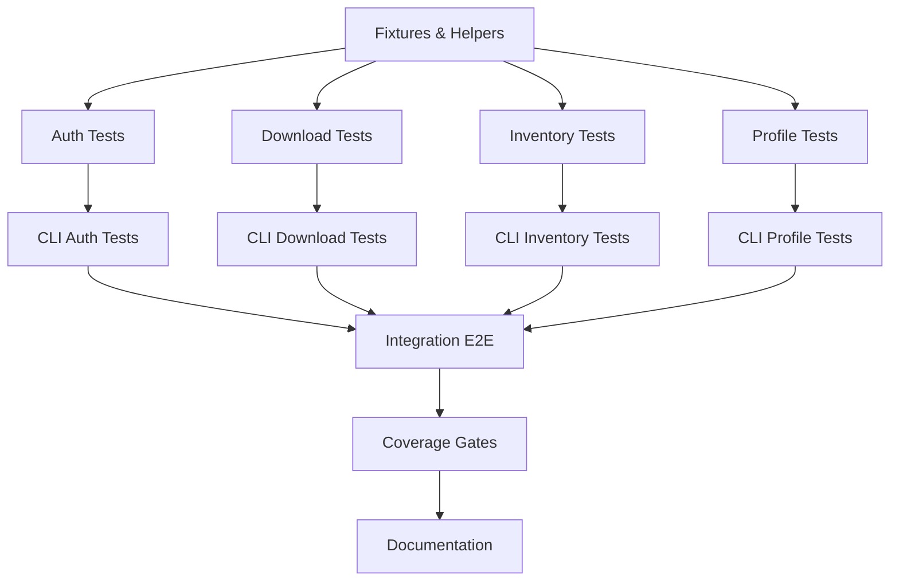

# Phase 8–9: Testing, Documentation, and Polish (Combined)

Purpose: Harden the `fetch-kaggle` job with exhaustive tests, tight coverage gates, and complete user/developer documentation. This combines and expands Phase 8 (Enhanced Testing) and Phase 9 (Documentation & Polish) into one precise, actionable plan.

---

## Recommended Execution Order

### Week 1: Foundation & Critical Path

**Priority: P0 (Must Have)**

1. **Test Fixtures & Helpers** (Section 6) - Build infrastructure first
2. **Auth Module Tests** (Section 1) - Most critical, highest risk
3. **CLI `--check-only` Tests** (Section 1.5) - Critical bug from Phase 7

### Week 2: Core Functionality

**Priority: P1 (Should Have)** 4. **Download Module Tests** (Section 2) 5. **Inventory Module Tests** (Section 3) 6. **Profile Module Tests** (Section 4)

### Week 3: Integration & Polish

**Priority: P2 (Nice to Have)** 7. **CLI Orchestrators** (Section 5) 8. **Integration & E2E** (Section 7) 9. **Coverage Gates** (Section 11)

### Week 4: Documentation

**Priority: P1 (Should Have)** 10. **Public API JSDoc** (Section 12) 11. **User Docs** (Section 13) 12. **Final Polish** (Section 14)

### Optional (Time Permitting)

**Priority: P3 (Could Have)**

- **Performance Baselines** (Section 10) - Guarded behind env flag

---

## Scope & Outcomes

- Raise confidence via edge-case, integration, and performance tests.
- Lock quality with coverage gates and CI-friendly checks.
- Document all public APIs and developer workflows.
- Ship user-facing docs with runnable examples.

---

## Quality Benchmarks (From Phase 2)

Reference implementation: **Branch `codex-p2`** | [Phase 2 Review](../reviews/PHASE-2-REVIEW.md)

**Expected Standards:**

- ✅ 100% statement coverage (target: ≥90%)
- ✅ ≥90% branch coverage
- ✅ Zero `any` types in implementation
- ✅ Comprehensive edge cases (empty, missing, malformed, large files)
- ✅ Atomic commits with Conventional Commits format
- ✅ Streaming for large files
- ✅ Proper async/await patterns
- ✅ Mock strategies with cleanup

**Phase 2 Achievements to Match:**

- 27 tests, 100% statement coverage
- Test execution < 400ms
- Clean separation: tests/ vs src/
- Known-hash verification for correctness
- Temp file handling with cleanup

---

## Risk Areas & Mitigation

### High Risk ⚠️

1. **Interactive Setup Testing** (auth/setup.test.ts)
   - **Risk:** Hard to mock `readline` and user input
   - **Mitigation:** Use abstraction layer for prompts; test with mock stdin
   - **Example:** Mock prompts module instead of readline directly

2. **OS-Specific Permissions** (auth/kaggle-json.test.ts)
   - **Risk:** chmod 0600 behaves differently on Windows
   - **Mitigation:** Guard tests with `process.platform !== 'win32'`
   - **Fallback:** Best-effort permission fixing with graceful degradation

3. **External Process Mocking** (download/fetch.test.ts, auth/verify-api.test.ts)
   - **Risk:** execa mocks can be tricky
   - **Mitigation:** Use `vi.spyOn` on execa module directly
   - **Example:** See Phase 4 existing tests for patterns

### Medium Risk ⚠️

4. **Large File Handling** (perf/hash.bench.test.ts)
   - **Risk:** CI environments may have limited disk/memory
   - **Mitigation:** Guard with `RUN_BENCHMARKS=1`, use temp files, cleanup

5. **Unicode Filename Testing** (download/process.test.ts)
   - **Risk:** OS/filesystem encoding differences
   - **Mitigation:** Test on multiple platforms if possible; document edge cases

---

## Task Dependencies



**Critical Path:** A → B → F → J → K → L

---

## Setup: Test Infrastructure

### Step 1: Install Additional Test Dependencies

```bash
pnpm add -D @vitest/ui         # For visual test debugging (optional)
```

### Step 2: Create Test Fixtures Structure

```bash
mkdir -p jobs/fetch-kaggle/tests/fixtures/datasets/{small,unicode,malformed}
mkdir -p jobs/fetch-kaggle/tests/helpers
```

### Step 3: Verify Baseline

```bash
cd jobs/fetch-kaggle
pnpm nx test fetch-kaggle --run  # Should show current coverage
```

### Step 4: Configure IDE (Optional)

- Enable Vitest extension in VSCode
- Set test file pattern: `**/*.test.ts`
- Enable coverage gutters for visual feedback

---

## Workstreams

- Test Suite Hardening (unit + edge cases)
- Integration & CLI E2E flows
- Performance baselines (opt-in)
- Coverage and quality gates
- Public API JSDoc
- User & migration docs
- Final polish and validations

---

## Test Suite Hardening

### 1. Auth Module

**Estimated Time: 6-8 hours**
**Complexity: High** (OS-specific permissions, interactive prompts)

- Add tests: `tests/unit/auth/env-check.test.ts` **(30 min)**
  - [ ] Returns creds when both env vars present
  - [ ] Returns null when missing one or both vars
  - [ ] Does not access filesystem

**Example Implementation:**

```typescript
import { describe, it, expect, beforeEach, afterEach } from 'vitest';
import { checkEnvVars } from '../../../src/lib/auth/env-check.js';

describe('checkEnvVars', () => {
  const originalEnv = { ...process.env };

  afterEach(() => {
    process.env = { ...originalEnv };
  });

  it('should return creds when both env vars present', () => {
    process.env.KAGGLE_USERNAME = 'testuser';
    process.env.KAGGLE_KEY = 'testkey123';

    const result = checkEnvVars();

    expect(result).toEqual({
      username: 'testuser',
      key: 'testkey123',
    });
  });

  it('should return null when missing one or both vars', () => {
    delete process.env.KAGGLE_USERNAME;
    process.env.KAGGLE_KEY = 'testkey123';

    expect(checkEnvVars()).toBeNull();
  });

  it('should not access filesystem', () => {
    // No fs calls should be made
    process.env.KAGGLE_USERNAME = 'test';
    process.env.KAGGLE_KEY = 'test';
    checkEnvVars();
    // Test passes if no fs errors occur
  });
});
```

- Add tests: `tests/unit/auth/kaggle-json.test.ts`
  - [ ] Valid JSON returns creds, fixes 0600 perms if wrong
  - [ ] Missing file returns null without throwing
  - [ ] Malformed JSON returns null with clear error path
  - [ ] Permission errors handled and surfaced

- Add tests: `tests/unit/auth/verify-api.test.ts`
  - [ ] Succeeds when `execa('kaggle ...')` resolves
  - [ ] Returns false on non-zero exit, timeout, missing binary
  - [ ] No uncaught rejections on failures

- Add tests: `tests/unit/auth/setup.test.ts`
  - [ ] Finds `kaggle.json` in Downloads and copies to `~/.kaggle/`
  - [ ] Prompts for custom path fallback
  - [ ] Applies 0600 permissions
  - [ ] Optional removal from Downloads respected
  - [ ] Mocks user input with `readline` / helper abstraction

- Add tests: `tests/unit/cli/auth.check-only.test.ts`
  - [ ] `fetch-kaggle auth --check-only` checks env/json and exits
  - [ ] Does NOT invoke interactive `setupKaggleJson()` when missing creds
  - [ ] Exit code reflects status (0=ready, 1=not ready)

### 2. Download Module

**Estimated Time: 4-5 hours**
**Complexity: Medium** (Process mocking, file I/O)

- Add tests: `tests/unit/download/fetch.test.ts` **(1.5 hours)**
  - [ ] Handles network/process failures (mock execa)
  - [ ] Times out respectfully and cleans temp state
  - [ ] Idempotent behavior on re-run

**Example Execa Mock:**

```typescript
import { vi } from 'vitest';
import { execa } from 'execa';

vi.mock('execa');
const execaMock = vi.mocked(execa);

it('should handle network failures gracefully', async () => {
  execaMock.mockRejectedValueOnce(new Error('ECONNREFUSED'));

  const result = await downloadDataset('/tmp/test', 'test/dataset');

  expect(result).toBe(false);
  expect(execaMock).toHaveBeenCalledWith(
    'kaggle',
    expect.arrayContaining(['datasets', 'download'])
  );
});
```

- Add tests: `tests/unit/download/process.test.ts`
  - [ ] Correct SHA256 calculation (small fixture)
  - [ ] Robust CSV row counting (header/no header/empty)
  - [ ] Handles Unicode filenames

- Add tests: `tests/unit/download/manifest.test.ts`
  - [ ] Writes manifest to `targetDir/download_manifest.json`
  - [ ] Validates with Zod schema
  - [ ] Includes checksums, row counts, dataset metadata

- Add tests: `tests/unit/download/validate.test.ts`
  - [ ] Passes for complete, consistent datasets
  - [ ] Fails when manifest/checksums missing
  - [ ] Fails when file sizes/hash mismatch

### 3. Inventory Module

**Estimated Time: 2-3 hours**
**Complexity: Low-Medium** (File system operations)

- Add tests: `tests/unit/inventory/index.test.ts` **(1.5 hours)**
  - [ ] Scans only expected file types/locations
  - [ ] Handles empty directories
  - [ ] Handles very large directory counts (mocked fs)
  - [ ] Resilient to unreadable files (permission error)

- Add tests: `tests/unit/cli/inventory.latest-dir.test.ts` **(1 hour)**
  - [ ] With no `--data-dir`, resolves latest YYYYMMDD directory
  - [ ] Throws or clear error when none found

### 4. Profile Module

**Estimated Time: 3-4 hours**
**Complexity: Medium** (CSV parsing edge cases)

- Add tests: `tests/unit/profile/index.test.ts` **(2 hours)**
  - [ ] Requires a valid string `targetDir`
  - [ ] Emits correct profile stats for mixed CSVs
  - [ ] Graceful handling of corrupted CSV (skipped + warning)

- Add tests: `tests/unit/cli/profile.dir-resolution.test.ts` **(1.5 hours)**
  - [ ] `fetch-kaggle profile` without `--data-dir` uses latest directory
  - [ ] No TypeError when option omitted (guard before `path.join`)
  - [ ] Clear error when no suitable directory exists

### 5. CLI Orchestrators

**Estimated Time: 2-3 hours**
**Complexity: Low** (Integration glue)

- Add tests: `tests/unit/cli/all.workflow.test.ts` **(2 hours)**
  - [ ] `fetch-kaggle all` passes the resolved directory to `runProfile`
  - [ ] Works when user omits `--data-dir`
  - [ ] Propagates step failures with readable messages

### 6. Fixtures & Helpers

**Estimated Time: 2-3 hours**
**Complexity: Low** (Infrastructure setup)

- Add directory: `tests/fixtures/`
  - [ ] `datasets/small/` with 2–3 tiny CSVs
  - [ ] `datasets/unicode/` filenames with Unicode
  - [ ] `datasets/malformed/` partially corrupted CSV

- Add helper: `tests/helpers/tmp.ts`
  - [ ] `makeTempDir(structure?: Spec): Promise<string>`
  - [ ] `writeCSV(path, rows): Promise<void>`
  - [ ] Centralized fs mocks/spies cleanup

- Conventions
  - [ ] Use `vi.spyOn` for fs and execa
  - [ ] Reset spies/mocks between tests
  - [ ] Prefer deterministic fixtures over randomness

---

## Integration & CLI E2E

**Estimated Time: 4-6 hours**
**Complexity: Medium-High** (End-to-end orchestration)

- File: `tests/integration/e2e.full-flow.test.ts` **(3 hours)**
  - [ ] Full flow: auth → download → inventory → profile (mock Kaggle CLI)
  - [ ] Multi-dataset scenario (two dataset IDs)
  - [ ] Resume-after-failure: simulate mid-run failure then succeed
  - [ ] `--data-dir` omission uses latest directory consistently across steps
  - [ ] Exit codes: 0 on success, non-zero on failure

- File: `tests/integration/e2e.cli-flags.test.ts` **(2 hours)**
  - [ ] `auth --check-only` never prompts
  - [ ] `profile` without `--data-dir` does not crash
  - [ ] `all` correctly wires resolved directory to `runProfile`

- Notes
  - [ ] Prefer importing orchestrators; if executing CLI, build once and run via `node dist/...`
  - [ ] Isolate env: set/unset `KAGGLE_USERNAME`/`KAGGLE_KEY` in each test

---

## Performance Baselines (Opt-in)

**Estimated Time: 3-4 hours**
**Complexity: Medium** (Performance measurement)

- File: `tests/perf/hash.bench.test.ts` **(2 hours)**
  - [ ] Benchmark `calculateSHA256` on a generated 100–200MB file
  - [ ] Report MB/s and CPU time

- File: `tests/perf/csv.bench.test.ts` **(1.5 hours)**
  - [ ] Benchmark row counting on concatenated CSV fixture

- Controls
  - [ ] Guard with `process.env.RUN_BENCHMARKS === '1'`
  - [ ] Excluded from default CI runs

**Example Benchmark:**

```typescript
import { describe, it } from 'vitest';
import { calculateSHA256 } from '../../../src/lib/utils/hash.js';
import fs from 'node:fs/promises';

describe.skipIf(!process.env.RUN_BENCHMARKS)('Hash Performance', () => {
  it('should benchmark SHA256 on 100MB file', async () => {
    // Generate 100MB test file
    const testFile = '/tmp/benchmark-100mb.bin';
    await fs.writeFile(testFile, Buffer.alloc(100 * 1024 * 1024));

    const start = performance.now();
    await calculateSHA256(testFile);
    const duration = performance.now() - start;

    const mbPerSec = (100 / (duration / 1000)).toFixed(2);
    console.log(`SHA256: ${duration.toFixed(2)}ms (${mbPerSec} MB/s)`);

    await fs.unlink(testFile);
  });
});
```

---

## Coverage & Quality Gates

**Estimated Time: 2-3 hours**
**Complexity: Low** (Configuration)

- vitest configuration
  - [ ] Set coverage thresholds (align with repo: 90% lines/func/branches/statements)
  - [ ] Configure reporters: `text`, `json-summary`, `lcov`
  - [ ] Tag long-running tests with `test.concurrent` or `test.skip` for CI as needed

- commands
  - [ ] `pnpm nx test fetch-kaggle --coverage --run`
  - [ ] `just test-coverage` (if using `just` helpers)

- acceptance
  - [ ] Coverage thresholds met or exceeded locally and in CI
  - [ ] Full suite completes in < 2 minutes on developer machines (excluding opt-in perf)

---

## Public API JSDoc

**Estimated Time: 8-10 hours**
**Complexity: Medium** (Documentation writing)

- Scope: All exported functions/types in `jobs/fetch-kaggle/src/lib/**` and `src/types/**`
- Tasks **(8 hours)**
  - [ ] Add JSDoc to every export: description, `@param`, `@returns`, `@example`, `@throws`
  - [ ] Add module-level comment to index files describing responsibilities
  - [ ] Ensure examples compile (copy-paste runnable)

- verification **(1 hour)**
  - [ ] Grep export vs. JSDoc counts roughly match
  - [ ] Spot-check examples by running them in a scratch script

**Example JSDoc:**

````typescript
/**
 * Calculates the SHA256 hash of a file using streaming for memory efficiency.
 *
 * @param filePath - Absolute path to the file to hash
 * @param options - Optional configuration
 * @param options.onProgress - Callback invoked with bytes processed
 * @returns Promise resolving to the SHA256 hash as a hex string
 * @throws {Error} If file does not exist or cannot be read
 *
 * @example
 * ```typescript
 * const hash = await calculateSHA256('/path/to/file.csv');
 * console.log(hash); // "a1b2c3d4..."
 *
 * // With progress tracking
 * const hashWithProgress = await calculateSHA256('/path/to/large.csv', {
 *   onProgress: (bytes) => console.log(`Processed ${bytes} bytes`)
 * });
 * ```
 */
export async function calculateSHA256(
  filePath: string,
  options?: { onProgress?: (bytes: number) => void }
): Promise<string> {
  // Implementation...
}
````

---

## User & Migration Docs

**Estimated Time: 6-8 hours**
**Complexity: Medium** (Technical writing)

- File: `jobs/fetch-kaggle/README.md` **(4 hours)**
  - [ ] Overview & architecture summary
  - [ ] Installation and prerequisites
  - [ ] Auth workflow with `--check-only` examples
  - [ ] Data directory conventions (YYYYMMDD) and latest-dir resolution
  - [ ] Usage examples for: `auth`, `download`, `inventory`, `profile`, `all`
  - [ ] Troubleshooting (timeouts, missing Kaggle CLI, permissions)

- File: `jobs/fetch-kaggle/MIGRATION.md` **(2 hours)**
  - [ ] Mapping Python → TypeScript functions/modules
  - [ ] Notable differences and rationale
  - [ ] Tips for validating parity

- CHANGELOG **(30 min)**
  - [ ] Add entries summarizing testing and documentation improvements

---

## Polish & Validations

**Estimated Time: 3-4 hours**
**Complexity: Low** (Quality assurance)

- CLI UX
  - [ ] Ensure `--check-only` is honored (no interactive prompts)
  - [ ] Ensure `profile` and `all` resolve directory when `--data-dir` omitted
  - [ ] Update `--help` text with above semantics and examples

- Lint & format
  - [ ] `pnpm lint` passes with no warnings
  - [ ] `pnpm format` applies Prettier style (2 spaces, single quotes, 100 cols)

- Consistency
  - [ ] No `any` types; explicit returns; no non-null assertions
  - [ ] Respect Nx boundaries (`libs/` for sharing)

---

## Definition of Done (Combined)

- Tests
  - [ ] Edge cases implemented across auth/download/inventory/profile/CLI
  - [ ] Integration tests for full flows and CLI flags
  - [ ] Performance tests guarded behind env flag
  - [ ] Coverage ≥ 90% statements/branches/functions/lines
  - [ ] Suite stable (no flakiness) and performant

- Docs
  - [ ] 100% of public exports documented with JSDoc
  - [ ] `jobs/fetch-kaggle/README.md` complete with runnable examples
  - [ ] `jobs/fetch-kaggle/MIGRATION.md` complete and accurate
  - [ ] CHANGELOG updated

- UX
  - [ ] CLI honors `--check-only`
  - [ ] `profile`/`all` handle missing `--data-dir` by resolving latest directory
  - [ ] Helpful `--help` output reflects real behavior

---

## Progress Tracking

### Test Coverage Dashboard

```bash
# Run this command to see live coverage:
pnpm nx test fetch-kaggle --coverage --watch

# Generate HTML report:
pnpm nx test fetch-kaggle --coverage --run
open coverage/index.html
```

### Metrics Checkpoints

- [ ] **Checkpoint 1 (Week 1):** Auth + Fixtures ≥85% coverage
- [ ] **Checkpoint 2 (Week 2):** All modules ≥85% coverage
- [ ] **Checkpoint 3 (Week 3):** Integration tests passing
- [ ] **Checkpoint 4 (Week 4):** ≥90% coverage, docs complete

### Daily Standup Template

```markdown
**Yesterday:** Completed auth/env-check.test.ts (5 tests, 100% coverage)
**Today:** Working on auth/kaggle-json.test.ts (permission tests)
**Blockers:** Windows permission testing needs investigation
**Coverage:** 82% statements, 75% branches (auth module)
```

---

## CI/CD Integration

### GitHub Actions Workflow

The repository already has CI configured. Tests will automatically run on:

- Push to any branch
- Pull request creation/updates
- Pre-push git hooks

**Expected CI Behavior:**

```bash
# On every push, GitHub Actions runs:
pnpm install --frozen-lockfile
pnpm nx affected -t lint --base=origin/main
pnpm nx affected -t test --base=origin/main --coverage
pnpm nx affected -t build --base=origin/main
```

### Pre-push Hook Validation

```bash
# This already runs via git hooks, but you can test manually:
pnpm nx affected -t test --base=origin/main --coverage

# Or test specific project:
pnpm nx test fetch-kaggle --coverage --run
```

### Coverage Reporting

Coverage reports are generated in `coverage/` directory:

- `coverage/lcov.info` - For CI/CD tools
- `coverage/coverage-summary.json` - Machine-readable summary
- `coverage/index.html` - Human-readable report

---

## Troubleshooting

### Common Issues

**Issue: "Cannot find module" errors in tests**

```bash
# Solution: Rebuild before running tests
pnpm nx build fetch-kaggle && pnpm nx test fetch-kaggle
```

**Issue: Permission tests failing on Windows**

```bash
# Solution: Skip platform-specific tests
it.skipIf(process.platform === 'win32')('should fix perms to 0600', async () => {
  // Test implementation
});
```

**Issue: Flaky execa mocks**

```typescript
// Solution: Use vi.spyOn with proper cleanup
import { vi, beforeEach, afterEach } from 'vitest';
import { execa } from 'execa';

vi.mock('execa');

beforeEach(() => {
  vi.clearAllMocks();
});

afterEach(() => {
  vi.resetAllMocks();
});

it('should mock execa correctly', async () => {
  const execaMock = vi.mocked(execa);
  execaMock.mockResolvedValueOnce({
    stdout: 'success',
    stderr: '',
    exitCode: 0,
  } as any);

  // Your test here
});
```

**Issue: Coverage not reaching 90%**

```bash
# Solution: Generate detailed report to find gaps
pnpm nx test fetch-kaggle --coverage --run --reporter=verbose
open coverage/index.html  # Visual coverage report

# Check uncovered lines:
grep -A 5 "uncovered" coverage/lcov.info
```

**Issue: Tests timing out**

```typescript
// Solution: Increase timeout for slow tests
import { describe, it } from 'vitest';

it('should handle large files', async () => {
  // Test implementation
}, 30000); // 30 second timeout
```

**Issue: Mock not being picked up**

```typescript
// Solution: Ensure mock is defined before imports
import { vi } from 'vitest';

// Mock BEFORE importing the module that uses it
vi.mock('execa');

// NOW import modules that depend on execa
import { downloadDataset } from '../../../src/lib/download/fetch.js';
```

**Issue: Git hooks preventing commit**

```bash
# Check what failed:
pnpm nx lint fetch-kaggle
pnpm nx test fetch-kaggle
pnpm nx build fetch-kaggle

# Fix issues, then commit again
git add .
git commit -m "fix: resolve test failures"

# Emergency bypass (not recommended):
git commit --no-verify -m "WIP: temporary commit"
```

---

## Quick Verification Commands

```bash
# Run unit + integration with coverage
pnpm nx test fetch-kaggle --coverage --run

# Build once for CLI-based integration (optional)
pnpm nx build fetch-kaggle
node dist/jobs/fetch-kaggle/src/cli/index.js auth --check-only || true
node dist/jobs/fetch-kaggle/src/cli/index.js profile            || true
node dist/jobs/fetch-kaggle/src/cli/index.js all                || true

# Opt-in performance
RUN_BENCHMARKS=1 pnpm nx test fetch-kaggle --run --testPathPattern=tests/perf
```

Notes

- Prefer deterministic, hermetic tests; mock external processes and IO.
- Keep fixtures tiny; synthesize larger inputs during tests when needed.
- If coverage or runtime is tight, move heavy tests under perf and guard by env flag.
