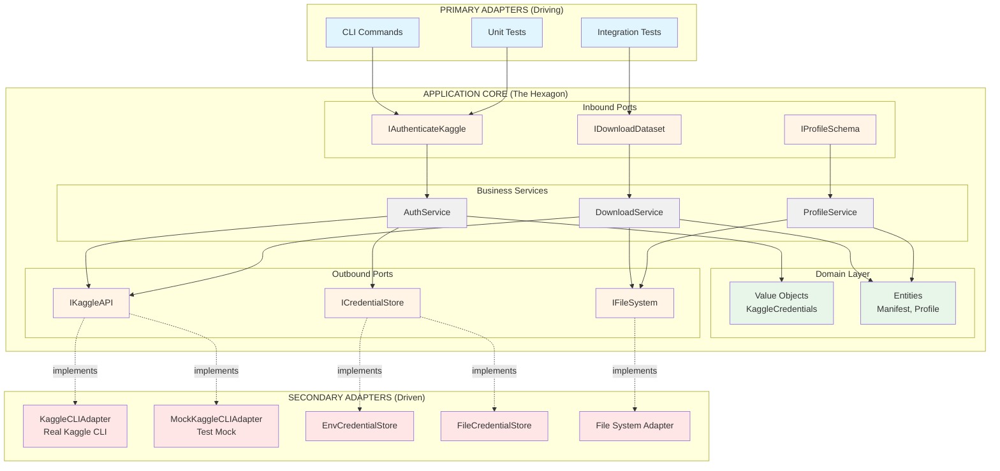
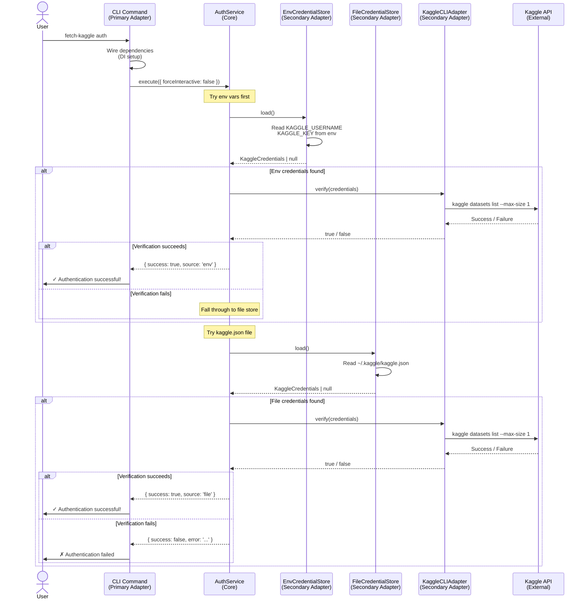
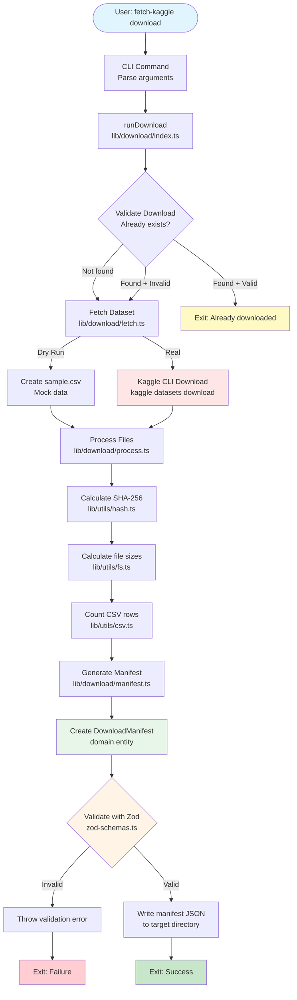

# fetch-kaggle Architecture

## Table of Contents

1. [Introduction](#introduction)
2. [Architectural Pattern](#architectural-pattern)
3. [High-Level Overview](#high-level-overview)
4. [Core Concepts](#core-concepts)
5. [Directory Structure](#directory-structure)
6. [Data Flow Examples](#data-flow-examples)
7. [Testing Strategy](#testing-strategy)
8. [Key Design Decisions](#key-design-decisions)
9. [Technology Stack](#technology-stack)
10. [References](#references)

---

## Introduction

**fetch-kaggle** is a TypeScript-based job for downloading, analyzing, and profiling Kaggle datasets. It implements **Hexagonal Architecture** (also known as Ports & Adapters) to achieve:

- ✅ **Testability**: Business logic isolated from external dependencies
- ✅ **Flexibility**: Easy to swap implementations (mock vs. real)
- ✅ **Maintainability**: Clear separation of concerns and explicit boundaries
- ✅ **Type Safety**: Strict TypeScript with domain entities and value objects

This architecture is particularly suited for infrastructure-heavy applications like fetch-kaggle, which interacts with:

- External CLI tools (Kaggle API)
- File system operations
- CSV parsing and analysis
- User input/output

---

## Architectural Pattern

### Hexagonal Architecture (Ports & Adapters)

Hexagonal Architecture organizes code around the **application core** (the "hexagon") and defines clear contracts (**ports**) for all interactions.

```
┌─────────────────────────────────────────────────┐
│         PRIMARY ADAPTERS (Driving)              │
│  ┌──────────┐  ┌──────────┐  ┌──────────┐      │
│  │   CLI    │  │  Tests   │  │   API    │      │
│  └────┬─────┘  └────┬─────┘  └────┬─────┘      │
│       │             │              │            │
│       └─────────────┼──────────────┘            │
│                     │                           │
│         ┌───────────▼───────────┐               │
│         │   INBOUND PORTS       │               │
│         │  (IAuthenticateKaggle)│               │
│         └───────────┬───────────┘               │
│                     │                           │
│         ┌───────────▼───────────┐               │
│         │   APPLICATION CORE    │               │
│         │   ┌──────────────┐    │               │
│         │   │   Services   │    │               │
│         │   │   Domain     │    │               │
│         │   └──────────────┘    │               │
│         └───────────┬───────────┘               │
│                     │                           │
│         ┌───────────▼───────────┐               │
│         │  OUTBOUND PORTS       │               │
│         │  (IKaggleAPI)         │               │
│         └───────────┬───────────┘               │
│                     │                           │
│       ┌─────────────┼──────────────┐            │
│       │             │              │            │
│  ┌────▼─────┐  ┌────▼─────┐  ┌────▼─────┐      │
│  │ Kaggle   │  │   File   │  │  Database│      │
│  │   CLI    │  │  System  │  │          │      │
│  └──────────┘  └──────────┘  └──────────┘      │
│         SECONDARY ADAPTERS (Driven)             │
└─────────────────────────────────────────────────┘
```

#### Mermaid Diagram: Hexagonal Architecture



#### Mermaid Class Diagram: Core Domain Model

```mermaid
classDiagram
    %% Value Objects
    class KaggleCredentials {
        <<Value Object>>
        -username: string
        -apiKey: string
        +create(username, apiKey)$ KaggleCredentials
        +toJSON() Object
        +equals(other) boolean
    }

    %% Entities
    class DownloadManifest {
        <<Entity>>
        +dataset: DatasetInfo
        +download_info: DownloadInfo
        +files: FileMetadata[]
    }

    class DataProfile {
        <<Entity>>
        +generated_at: string
        +source_directory: string
        +profiles: FileProfile[]
    }

    class FileMetadata {
        +filename: string
        +path: string
        +size_bytes: number
        +sha256: string
        +row_count: number
    }

    %% Inbound Ports
    class IAuthenticateKaggle {
        <<Inbound Port>>
        +execute(request) Promise~AuthResponse~
    }

    class IDownloadDataset {
        <<Inbound Port>>
        +execute(request) Promise~DownloadResponse~
    }

    %% Outbound Ports
    class IKaggleAPI {
        <<Outbound Port>>
        +verify(credentials) Promise~boolean~
        +downloadDataset(id, dir) Promise~void~
    }

    class ICredentialStore {
        <<Outbound Port>>
        +load() Promise~KaggleCredentials~
        +save(credentials) Promise~void~
        +exists() Promise~boolean~
    }

    %% Services
    class AuthService {
        <<Service>>
        -kaggleAPI: IKaggleAPI
        -envStore: ICredentialStore
        -fileStore: ICredentialStore
        +execute(request) Promise~AuthResponse~
    }

    class DownloadService {
        <<Service>>
        -kaggleAPI: IKaggleAPI
        -fileSystem: IFileSystem
        +execute(request) Promise~DownloadResponse~
    }

    %% Adapters
    class KaggleCLIAdapter {
        <<Secondary Adapter>>
        +verify(credentials) Promise~boolean~
        +downloadDataset(id, dir) Promise~void~
    }

    class EnvCredentialStore {
        <<Secondary Adapter>>
        +load() Promise~KaggleCredentials~
        +save(credentials) Promise~void~
        +exists() Promise~boolean~
    }

    %% Relationships
    AuthService ..|> IAuthenticateKaggle : implements
    DownloadService ..|> IDownloadDataset : implements

    AuthService --> IKaggleAPI : depends on
    AuthService --> ICredentialStore : depends on
    AuthService --> KaggleCredentials : uses

    DownloadService --> IKaggleAPI : depends on
    DownloadService --> DownloadManifest : creates

    DownloadManifest --> FileMetadata : contains

    KaggleCLIAdapter ..|> IKaggleAPI : implements
    EnvCredentialStore ..|> ICredentialStore : implements

    ICredentialStore --> KaggleCredentials : returns

    %% Styling
    style KaggleCredentials fill:#e8f5e9
    style DownloadManifest fill:#e8f5e9
    style DataProfile fill:#e8f5e9
    style FileMetadata fill:#e8f5e9
    style IAuthenticateKaggle fill:#fff4e6
    style IDownloadDataset fill:#fff4e6
    style IKaggleAPI fill:#fff4e6
    style ICredentialStore fill:#fff4e6
    style AuthService fill:#f0f0f0
    style DownloadService fill:#f0f0f0
    style KaggleCLIAdapter fill:#ffe6e6
    style EnvCredentialStore fill:#ffe6e6
```



### Key Concepts

1. **Application Core (The Hexagon)**
   - Contains business logic, domain entities, and use cases
   - Zero dependencies on frameworks or external libraries
   - Defines **ports** (interfaces) for all external interactions

2. **Primary Adapters (Driving)**
   - Drive the application (initiate actions)
   - Examples: CLI, HTTP API, Tests
   - Call **inbound ports** to trigger use cases

3. **Secondary Adapters (Driven)**
   - Provide services to the application
   - Examples: Database, External APIs, File System
   - Implement **outbound ports** defined by the core

4. **Ports**
   - **Inbound Ports**: Define what the application can do (use cases)
   - **Outbound Ports**: Define what the application needs (dependencies)

5. **Dependency Rule**
   - Dependencies point **inward** toward the core
   - Core never depends on adapters
   - Adapters depend on ports defined by the core

---

## High-Level Overview

```
fetch-kaggle/
├── src/
│   ├── core/                    # APPLICATION CORE (The Hexagon)
│   │   ├── domain/              # Business entities & value objects
│   │   ├── ports/               # Interface contracts
│   │   │   ├── inbound/        # What our app can do (use cases)
│   │   │   └── outbound/       # What our app needs (dependencies)
│   │   └── services/            # Business logic implementation
│   │
│   ├── adapters/                # ADAPTERS (Outside the hexagon)
│   │   ├── primary/             # Driving adapters (currently in cli/)
│   │   └── secondary/           # Driven adapters (external integrations)
│   │
│   ├── cli/                     # CLI Commands (Primary Adapter)
│   ├── lib/                     # Feature implementations (organized by use case)
│   └── infrastructure/          # Cross-cutting concerns (config, validation)
│
└── tests/
    ├── unit/                    # Fast, isolated tests (use mocks)
    ├── integration/             # Multi-component tests (real adapters)
    └── fixtures/                # Test data and helpers
```

**Design Philosophy:**

- **Core**: Pure business logic with no I/O
- **Adapters**: Handle all external interactions
- **Lib**: Feature-oriented organization (auth, download, profile, inventory)
- **Infrastructure**: Configuration and cross-cutting concerns

---

## Core Concepts

### Domain Layer

The domain layer contains the business entities and value objects that represent core concepts.

#### Value Objects

**Immutable objects defined by their attributes, not identity.**

**Example: [KaggleCredentials](src/core/domain/value-objects/kaggle-credentials.ts)**

```typescript
export class KaggleCredentials {
  private constructor(
    public readonly username: string,
    public readonly apiKey: string
  ) {}

  static create(username: string, apiKey: string): KaggleCredentials {
    // Self-validating
    if (!username || username.trim().length === 0) {
      throw new Error('Username cannot be empty');
    }
    if (!apiKey || apiKey.length < 20) {
      throw new Error('Invalid API key format');
    }
    return new KaggleCredentials(username.trim(), apiKey);
  }

  equals(other: KaggleCredentials): boolean {
    return this.username === other.username && this.apiKey === other.apiKey;
  }
}
```

**Key characteristics:**

- Immutable (`readonly` fields)
- Self-validating (factory method with validation)
- Value equality (`.equals()` method)
- Private constructor (enforce validation)

#### Entities

**Objects with identity that persist over time.**

**Examples:**

- [DownloadManifest](src/core/domain/entities/manifest.ts) - Metadata about downloaded datasets
- [DataProfile](src/core/domain/entities/profile.ts) - Schema profiling results
- [InventoryReport](src/core/domain/entities/inventory.ts) - Dataset inventory analysis

```typescript
// manifest.ts
export interface DownloadManifest {
  dataset: {
    name: string;
    kaggle_id: string;
    url: string;
    download_timestamp: string;
  };
  download_info: {
    date: string;
    directory: string;
    total_files: number;
    total_size_mb: number;
    total_rows: number;
  };
  files: FileMetadata[];
}
```

**Entities vs. Value Objects:**

- Entities have identity (can be tracked over time)
- Value objects are defined by their attributes
- Both enforce domain invariants

---

### Ports (Interface Contracts)

Ports define the boundaries of the application core.

#### Inbound Ports (Primary Ports)

**Define what the application can do (use cases).**

**Example: [IAuthenticateKaggle](src/core/ports/inbound/authenticate-kaggle.port.ts)**

```typescript
export interface AuthenticateKaggleRequest {
  forceInteractive?: boolean;
}

export interface AuthenticateKaggleResponse {
  success: boolean;
  source: 'env' | 'file' | 'interactive' | null;
  error?: string;
}

export interface IAuthenticateKaggle {
  execute(request: AuthenticateKaggleRequest): Promise<AuthenticateKaggleResponse>;
}
```

**Characteristics:**

- Command/Query interface
- Use case-oriented (not CRUD)
- Request/Response DTOs
- Called by primary adapters (CLI, tests)

#### Outbound Ports (Secondary Ports)

**Define what the application needs from external world.**

**Example: [IKaggleAPI](src/core/ports/outbound/kaggle-api.port.ts)**

```typescript
export interface IKaggleAPI {
  verify(credentials: KaggleCredentials): Promise<boolean>;
  downloadDataset(datasetId: string, targetDir: string): Promise<void>;
}

export interface ICredentialStore {
  load(): Promise<KaggleCredentials | null>;
  save(credentials: KaggleCredentials): Promise<void>;
  exists(): Promise<boolean>;
}
```

**Characteristics:**

- Abstract external dependencies
- Technology-agnostic (no Kaggle CLI details)
- Implemented by secondary adapters
- Enable easy mocking for tests

---

### Services (Business Logic)

Services implement inbound ports and orchestrate business logic.

**Example: [AuthService](src/core/services/auth.service.ts)**

```typescript
export class AuthService implements IAuthenticateKaggle {
  constructor(
    private readonly kaggleAPI: IKaggleAPI, // Outbound port
    private readonly envStore: ICredentialStore, // Outbound port
    private readonly fileStore: ICredentialStore // Outbound port
  ) {}

  async execute(request: AuthenticateKaggleRequest): Promise<AuthenticateKaggleResponse> {
    // 1. Try environment variables first (fastest, no file I/O)
    if (!request.forceInteractive) {
      const envCreds = await this.envStore.load();
      if (envCreds) {
        const isValid = await this.kaggleAPI.verify(envCreds);
        if (isValid) {
          return { success: true, source: 'env' };
        }
      }
    }

    // 2. Try kaggle.json file
    if (!request.forceInteractive) {
      const fileCreds = await this.fileStore.load();
      if (fileCreds) {
        const isValid = await this.kaggleAPI.verify(fileCreds);
        if (isValid) {
          return { success: true, source: 'file' };
        }
      }
    }

    // 3. No valid credentials found
    return {
      success: false,
      source: null,
      error: 'No valid Kaggle credentials found',
    };
  }
}
```

**Key points:**

- Implements **inbound port** (use case interface)
- Depends on **outbound ports** (abstractions, not implementations)
- Pure business logic (no I/O, no framework dependencies)
- Constructor dependency injection
- Testable in isolation with mocks

---

### Adapters

Adapters connect the application core to the outside world.

#### Primary Adapters (Driving)

Drive the application by calling inbound ports.

**Example: [CLI Commands](src/cli/commands/auth.ts)**

```typescript
export default function authCommand(): Command {
  const command = new Command('auth');

  command
    .description('Authenticate with Kaggle')
    .option('--check-only', 'Check authentication status without setup')
    .action(async (options) => {
      try {
        // Wire up dependencies
        const kaggleAPI = new KaggleCLIAdapter();
        const envStore = new EnvCredentialStore();
        const fileStore = new FileCredentialStore();
        const authService = new AuthService(kaggleAPI, envStore, fileStore);

        // Execute use case
        const result = await authService.execute({
          forceInteractive: !options.checkOnly,
        });

        if (result.success) {
          console.log('✓ Authentication successful!');
          process.exit(0);
        } else {
          console.error('✗ Authentication failed');
          process.exit(1);
        }
      } catch (error) {
        console.error('Error:', error.message);
        process.exit(1);
      }
    });

  return command;
}
```

**Other Primary Adapters:**

- [CLI index](src/cli/index.ts) - Commander.js setup
- [Tests](tests/unit/auth/auth.service.test.ts) - Tests are adapters too!

#### Secondary Adapters (Driven)

Implement outbound ports to provide services to the core.

**Example: [KaggleCLIAdapter](src/adapters/secondary/kaggle-cli.adapter.ts)** (Real Implementation)

```typescript
export class KaggleCLIAdapter implements IKaggleAPI {
  async verify(credentials: KaggleCredentials): Promise<boolean> {
    try {
      await execa('kaggle', ['datasets', 'list', '--max-size', '1'], {
        env: {
          KAGGLE_USERNAME: credentials.username,
          KAGGLE_KEY: credentials.apiKey,
        },
        timeout: 10000,
      });
      return true;
    } catch {
      return false;
    }
  }

  async downloadDataset(datasetId: string, targetDir: string): Promise<void> {
    await execa('kaggle', ['datasets', 'download', datasetId, '-p', targetDir, '--unzip']);
  }
}
```

**Example: [MockKaggleCLIAdapter](src/adapters/secondary/mock-kaggle-cli.adapter.ts)** (Test Implementation)

```typescript
export class MockKaggleCLIAdapter implements IKaggleAPI {
  constructor(private shouldSucceed: boolean = true) {}

  async verify(credentials: KaggleCredentials): Promise<boolean> {
    return this.shouldSucceed;
  }

  async downloadDataset(datasetId: string, targetDir: string): Promise<void> {
    if (!this.shouldSucceed) {
      throw new Error('Mock download failed');
    }
    // No actual download in tests
  }
}
```

**Benefits:**

- Same interface, different implementations
- Tests use mocks (fast, no external dependencies)
- Production uses real adapters (actual Kaggle CLI)
- Easy to add new adapters (HTTP API, different CLI tool)

---

### Infrastructure

Cross-cutting concerns that don't belong in the core but are needed everywhere.

#### Configuration

**[config.ts](src/infrastructure/config.ts)** - Application-wide constants

```typescript
const JOB_ROOT = join(__dirname, '..', '..');

export const KAGGLE_CONFIG = {
  datasetId: 'erlichsefi/israeli-supermarkets-2024',
  datasetUrl: 'https://www.kaggle.com/datasets/erlichsefi/israeli-supermarkets-2024',
  dataRoot: join(JOB_ROOT, 'data', 'kaggle_raw'),
  reportsDir: join(JOB_ROOT, 'data', 'reports'),
  metadataDir: join(JOB_ROOT, 'data', 'metadata'),
} as const;

export const KAGGLE_PATHS = {
  kaggleJson: `${process.env.HOME}/.kaggle/kaggle.json`,
  kaggleDir: `${process.env.HOME}/.kaggle`,
  apiTokenUrl: 'https://www.kaggle.com/settings/account',
} as const;
```

**Key points:**

- ESM-compatible path resolution
- Typed constants (`as const`)
- Single source of truth for paths

#### Runtime Validation

**[zod-schemas.ts](src/infrastructure/zod-schemas.ts)** - Zod schemas for runtime validation

```typescript
export const DownloadManifestSchema = z.object({
  dataset: z.object({
    name: z.string(),
    kaggle_id: z.string(),
    url: z.string().url(),
    download_timestamp: z.string().datetime(),
  }),
  download_info: z.object({
    date: z.string(),
    directory: z.string(),
    total_files: z.number(),
    total_size_mb: z.number(),
    total_rows: z.number(),
  }),
  files: z.array(FileMetadataSchema),
});
```

**Purpose:**

- Validate data from external sources (JSON files, API responses)
- Complement TypeScript compile-time types
- Catch runtime errors early

---

## Directory Structure

### Complete Structure with References

```
fetch-kaggle/
├── src/
│   ├── core/                                    # APPLICATION CORE
│   │   ├── domain/                             # Business entities
│   │   │   ├── entities/
│   │   │   │   ├── manifest.ts                 # DownloadManifest entity
│   │   │   │   ├── profile.ts                  # DataProfile entity
│   │   │   │   └── inventory.ts                # InventoryReport entity
│   │   │   └── value-objects/
│   │   │       └── kaggle-credentials.ts       # Immutable credentials VO
│   │   ├── ports/                              # Interface contracts
│   │   │   ├── inbound/                        # Use case interfaces
│   │   │   │   └── authenticate-kaggle.port.ts # Auth use case
│   │   │   └── outbound/                       # Dependency interfaces
│   │   │       └── kaggle-api.port.ts          # IKaggleAPI, ICredentialStore
│   │   └── services/                           # Business logic
│   │       └── auth.service.ts                 # Authentication service
│   │
│   ├── adapters/                               # ADAPTERS
│   │   └── secondary/                          # Driven adapters
│   │       ├── kaggle-cli.adapter.ts           # Real Kaggle CLI
│   │       └── mock-kaggle-cli.adapter.ts      # Mock for tests
│   │
│   ├── cli/                                    # PRIMARY ADAPTER (CLI)
│   │   ├── commands/                           # Commander.js commands
│   │   │   ├── auth.ts                         # Auth command
│   │   │   ├── download.ts                     # Download command
│   │   │   ├── inventory.ts                    # Inventory command
│   │   │   ├── profile.ts                      # Profile command
│   │   │   └── all.ts                          # All-in-one command
│   │   ├── index.ts                            # CLI entry point
│   │   └── README.md                           # CLI usage docs
│   │
│   ├── lib/                                    # FEATURE IMPLEMENTATIONS
│   │   ├── auth/                               # Authentication feature
│   │   │   ├── index.ts                        # ensureKaggleAuth()
│   │   │   ├── env-check.ts                    # Check env vars
│   │   │   ├── kaggle-json.ts                  # Check kaggle.json
│   │   │   ├── verify-api.ts                   # Verify with Kaggle API
│   │   │   └── setup.ts                        # Interactive setup
│   │   ├── download/                           # Download feature
│   │   │   ├── index.ts                        # runDownload()
│   │   │   ├── fetch.ts                        # Fetch dataset
│   │   │   ├── manifest.ts                     # Generate manifest
│   │   │   ├── process.ts                      # Process files
│   │   │   └── validate.ts                     # Validate download
│   │   ├── inventory/                          # Inventory analysis
│   │   │   ├── index.ts                        # runInventory()
│   │   │   ├── analyze.ts                      # Analyze datasets
│   │   │   ├── pattern.ts                      # File pattern detection
│   │   │   └── report.ts                       # Generate markdown report
│   │   ├── profile/                            # Schema profiling
│   │   │   ├── index.ts                        # runProfile()
│   │   │   ├── select.ts                       # Select files to profile
│   │   │   ├── file.ts                         # Profile single file
│   │   │   ├── column.ts                       # Analyze column
│   │   │   ├── family.ts                       # Detect family/chain
│   │   │   └── directory.ts                    # Detect dataset date
│   │   └── utils/                              # Utility functions
│   │       ├── fs.ts                           # File system helpers
│   │       ├── csv.ts                          # CSV parsing
│   │       ├── hash.ts                         # SHA-256 hashing
│   │       └── console.ts                      # Console output helpers
│   │
│   ├── infrastructure/                         # CROSS-CUTTING CONCERNS
│   │   ├── config.ts                           # Configuration constants
│   │   └── zod-schemas.ts                      # Runtime validation
│   │
│   └── main.ts                                 # Job entry point
│
├── tests/                                      # TESTS (Primary Adapters)
│   ├── unit/                                   # Unit tests (fast, isolated)
│   │   ├── auth/                               # Auth module tests
│   │   │   ├── auth.service.test.ts            # Core service tests
│   │   │   ├── env-check.test.ts
│   │   │   ├── kaggle-json.test.ts
│   │   │   ├── verify-api.test.ts
│   │   │   ├── setup.test.ts
│   │   │   └── main.test.ts
│   │   ├── download/                           # Download module tests
│   │   ├── inventory/                          # Inventory module tests
│   │   ├── profile/                            # Profile module tests
│   │   ├── utils/                              # Utility tests
│   │   └── cli/                                # CLI command tests
│   ├── integration/                            # Integration tests
│   │   ├── download-flow.test.ts               # Full download workflow
│   │   ├── inventory-flow.test.ts              # Full inventory workflow
│   │   └── profile-flow.test.ts                # Full profile workflow
│   ├── fixtures/                               # Test data
│   │   └── datasets/                           # Sample CSV files
│   │       ├── small/                          # Small test datasets
│   │       ├── malformed/                      # Invalid data for error testing
│   │       └── unicode/                        # Unicode handling tests
│   └── helpers/
│       └── tmp.ts                              # Temporary file helpers
│
├── data/                                       # DATA DIRECTORIES (gitignored)
│   ├── kaggle_raw/                             # Downloaded datasets
│   │   └── YYYYMMDD/                           # Date-based folders
│   ├── metadata/                               # Profiles, manifests
│   └── reports/                                # Generated reports
│
├── project.json                                # Nx configuration
├── vitest.config.ts                            # Vitest configuration
├── tsconfig.json                               # TypeScript config (extends base)
├── tsconfig.app.json                           # App compilation settings
├── eslint.config.mjs                           # ESLint configuration
├── README.md                                   # User documentation
└── ARCHITECTURE.md                             # This file
```

---

## Data Flow Examples

### Example 1: Authentication Flow

#### Mermaid Sequence Diagram: Authentication Flow



**Scenario:** User runs `fetch-kaggle auth`

```
┌─────────────────────────────────────────────────────────────────┐
│ 1. CLI Command (Primary Adapter)                               │
│    src/cli/commands/auth.ts                                    │
│    - Parses command-line arguments                             │
│    - Wires up dependencies (AuthService + adapters)            │
└────────────────────┬────────────────────────────────────────────┘
                     │
                     │ execute({ forceInteractive: false })
                     ▼
┌─────────────────────────────────────────────────────────────────┐
│ 2. AuthService (Core Business Logic)                          │
│    src/core/services/auth.service.ts                           │
│    - Implements IAuthenticateKaggle (inbound port)             │
│    - Depends on IKaggleAPI, ICredentialStore (outbound ports)  │
└────────────────────┬────────────────────────────────────────────┘
                     │
                     │ 1. envStore.load()
                     ▼
┌─────────────────────────────────────────────────────────────────┐
│ 3. EnvCredentialStore (Secondary Adapter)                      │
│    src/adapters/secondary/env-credential-store.adapter.ts      │
│    - Reads KAGGLE_USERNAME, KAGGLE_KEY from process.env        │
│    - Returns KaggleCredentials or null                         │
└────────────────────┬────────────────────────────────────────────┘
                     │
                     │ KaggleCredentials or null
                     ▼
┌─────────────────────────────────────────────────────────────────┐
│ 4. AuthService (continued)                                     │
│    - If credentials found, verify with API                     │
└────────────────────┬────────────────────────────────────────────┘
                     │
                     │ kaggleAPI.verify(credentials)
                     ▼
┌─────────────────────────────────────────────────────────────────┐
│ 5. KaggleCLIAdapter (Secondary Adapter)                        │
│    src/adapters/secondary/kaggle-cli.adapter.ts                │
│    - Executes `kaggle datasets list --max-size 1`              │
│    - Returns true if successful, false otherwise               │
└────────────────────┬────────────────────────────────────────────┘
                     │
                     │ boolean
                     ▼
┌─────────────────────────────────────────────────────────────────┐
│ 6. AuthService (final)                                         │
│    - Returns AuthenticateKaggleResponse                        │
│      { success: true, source: 'env' }                          │
└────────────────────┬────────────────────────────────────────────┘
                     │
                     │ AuthenticateKaggleResponse
                     ▼
┌─────────────────────────────────────────────────────────────────┐
│ 7. CLI Command (result handling)                              │
│    - Prints success message                                    │
│    - Exits with code 0                                         │
└─────────────────────────────────────────────────────────────────┘
```

**Key Observations:**

- CLI knows about Commander.js framework
- Core service has zero knowledge of CLI, env vars, or Kaggle CLI
- Easy to swap adapters (e.g., mock for tests)
- Each layer has a single responsibility

---

### Example 2: Testing with Mocks

**Scenario:** Unit test for AuthService with mocked dependencies

```typescript
// tests/unit/auth/auth.service.test.ts
describe('AuthService', () => {
  it('should authenticate with env credentials', async () => {
    // Arrange - Create mock adapters
    const mockKaggleAPI = new MockKaggleCLIAdapter(true); // Always succeeds
    const mockEnvStore = new MockCredentialStore({
      username: 'test-user',
      apiKey: 'test-key-1234567890123456',
    });
    const mockFileStore = new MockCredentialStore(null); // No file creds

    // Create service with mocked dependencies
    const authService = new AuthService(mockKaggleAPI, mockEnvStore, mockFileStore);

    // Act - Execute use case
    const result = await authService.execute({ forceInteractive: false });

    // Assert - Verify business logic
    expect(result.success).toBe(true);
    expect(result.source).toBe('env');
    expect(result.error).toBeUndefined();
  });
});
```

**Benefits:**

- No external dependencies (Kaggle API, file system)
- Fast (milliseconds, not seconds)
- Deterministic (no flaky tests)
- Tests business logic in isolation
- Easy to test edge cases

---

### Example 3: Download Flow (Feature Organization)

**Scenario:** Download a Kaggle dataset

#### Mermaid Flowchart: Download Workflow



```
┌─────────────────────────────────────────────────────────────────┐
│ 1. CLI Command                                                 │
│    src/cli/commands/download.ts                                │
│    - Parse dataset ID from arguments                           │
│    - Call runDownload({ datasetId, dryRun })                   │
└────────────────────┬────────────────────────────────────────────┘
                     │
                     ▼
┌─────────────────────────────────────────────────────────────────┐
│ 2. Download Feature                                            │
│    src/lib/download/index.ts                                   │
│    - Orchestrates download workflow                            │
│    - Calls: validate → fetch → process → manifest              │
└────────────────────┬────────────────────────────────────────────┘
                     │
                     │ 1. validate({ datasetId, targetDir })
                     ▼
┌─────────────────────────────────────────────────────────────────┐
│ 3. Validate Download                                           │
│    src/lib/download/validate.ts                                │
│    - Check if dataset already downloaded                       │
│    - Verify manifest integrity                                 │
└────────────────────┬────────────────────────────────────────────┘
                     │
                     │ 2. fetchDataset({ datasetId, targetDir })
                     ▼
┌─────────────────────────────────────────────────────────────────┐
│ 4. Fetch Dataset                                               │
│    src/lib/download/fetch.ts                                   │
│    - Use Kaggle CLI to download                                │
│    - Or create sample CSV in dry-run mode                      │
└────────────────────┬────────────────────────────────────────────┘
                     │
                     │ 3. processFiles({ targetDir })
                     ▼
┌─────────────────────────────────────────────────────────────────┐
│ 5. Process Files                                               │
│    src/lib/download/process.ts                                 │
│    - Calculate file sizes                                      │
│    - Generate SHA-256 hashes                                   │
│    - Count CSV rows                                            │
└────────────────────┬────────────────────────────────────────────┘
                     │
                     │ 4. generateManifest({ files, datasetInfo })
                     ▼
┌─────────────────────────────────────────────────────────────────┐
│ 6. Generate Manifest                                           │
│    src/lib/download/manifest.ts                                │
│    - Create DownloadManifest entity                            │
│    - Validate with Zod schema                                  │
│    - Write download_manifest.json                              │
└─────────────────────────────────────────────────────────────────┘
```

**Feature Organization Pattern:**

- Each feature has its own directory in `lib/`
- `index.ts` exports the main orchestration function
- Sub-modules handle specific responsibilities
- Features use utilities from `lib/utils/`
- Features can use domain entities from `core/domain/`

---

## Testing Strategy

### Test Pyramid

```
        ┌───────────────┐
        │      E2E      │  Few (expensive, slow)
        │   Integration │
        └───────────────┘
           ┌─────────────────┐
           │   Integration   │  Some (moderate speed)
           │   (real adapters)│
           └─────────────────┘
              ┌──────────────────────┐
              │       Unit Tests     │  Many (fast, isolated)
              │     (mocked adapters)│
              └──────────────────────┘
```

### Unit Tests

**Location:** [`tests/unit/`](tests/unit/)

**Characteristics:**

- Test single components in isolation
- Use mocked dependencies
- Fast (milliseconds per test)
- High coverage (90%+ threshold)

**Example:** [auth.service.test.ts](tests/unit/auth/auth.service.test.ts)

```typescript
describe('AuthService', () => {
  it('should try env vars first', async () => {
    const mockAPI = new MockKaggleCLIAdapter(true);
    const envStore = new MockCredentialStore(validCreds);
    const fileStore = new MockCredentialStore(null);

    const service = new AuthService(mockAPI, envStore, fileStore);
    const result = await service.execute({});

    expect(result.source).toBe('env');
  });
});
```

### Integration Tests

**Location:** [`tests/integration/`](tests/integration/)

**Characteristics:**

- Test multiple components together
- Use real adapters (file system, etc.)
- Moderate speed (seconds per test)
- Verify component interactions

**Example:** [download-flow.test.ts](tests/integration/download-flow.test.ts)

```typescript
describe('download flow (integration)', () => {
  it('should complete full flow in dry-run mode', async () => {
    const code = await runDownload({ datasetId: 'user/dataset', dryRun: true });
    expect([0, 2]).toContain(code);

    // Verify manifest exists
    const manifestPath = path.join(root, latest, 'download_manifest.json');
    const exists = await fs
      .access(manifestPath)
      .then(() => true)
      .catch(() => false);
    expect(exists).toBe(true);
  });
});
```

### Test Fixtures

**Location:** [`tests/fixtures/`](tests/fixtures/)

**Purpose:**

- Sample CSV files for testing
- Edge cases: empty, malformed, unicode
- Temporary file helpers

**Example:**

- `fixtures/datasets/small/` - Small test datasets
- `fixtures/datasets/malformed/` - Invalid data for error paths
- `fixtures/datasets/unicode/` - Unicode handling

---

## Key Design Decisions

### 1. Why Hexagonal Architecture?

**Problem:** Traditional layered architecture tightly couples business logic to infrastructure.

**Solution:** Hexagonal architecture inverts dependencies, making the core independent.

**Benefits for fetch-kaggle:**

- Easy to mock Kaggle CLI for tests
- Can swap file system implementation (in-memory for tests)
- CSV parsing abstracted behind ports
- Infrastructure-heavy app benefits from clear boundaries

**Trade-offs:**

- More upfront design (define ports)
- More files/folders (adapters separated)
- Learning curve for developers unfamiliar with pattern

**Verdict:** Worth it for a complex, infrastructure-heavy job like fetch-kaggle.

---

### 2. Why Separate `lib/` and `core/`?

**`core/`** - Pure domain logic

- Entities, value objects, ports, services
- Zero dependencies on external libraries
- Framework-agnostic

**`lib/`** - Feature implementations

- Uses core entities and services
- Organized by feature (auth, download, profile)
- Can depend on libraries (execa, csv-parse)

**Why this split?**

- Core is the "business rules" (portable, reusable)
- Lib is the "application logic" (specific to this job)
- Easier to extract core into a shared library later

---

### 3. Why Tests Separate from `src/`?

**Alternative:** Co-locate tests (`src/**/*.test.ts`)

**Chosen:** Separate `tests/` directory

**Rationale:**

- Cleaner source directory
- Simpler build exclusion (don't need complex glob patterns)
- Easier to manage test fixtures and helpers
- Consistent with monorepo convention (see [CLAUDE.md:108-114](../../CLAUDE.md#L108-L114))

---

### 4. Why Vitest Instead of Jest?

**Reasons:**

- Native ESM support (no transpilation hacks)
- Faster test execution (parallelization, smart caching)
- Better TypeScript integration
- Monorepo standard (consistent with other jobs)
- Vite ecosystem (future-proof)

---

### 5. Why Commander.js for CLI?

**Alternatives:** yargs, oclif, cliffy

**Chosen:** Commander.js

**Reasons:**

- Lightweight and simple
- Excellent TypeScript support
- Well-maintained and widely used
- Easy to test (just call command functions)
- Git-style subcommands (`fetch-kaggle auth`, `fetch-kaggle download`)

---

### 6. Why Zod for Runtime Validation?

**TypeScript** provides compile-time safety, but we need **runtime** validation for:

- External data (Kaggle API responses, JSON files)
- User input (CLI arguments)
- File parsing (CSV, JSON manifests)

**Zod** provides:

- Type inference (single source of truth)
- Runtime validation
- Clear error messages
- Composable schemas

**Example:**

```typescript
const DownloadManifestSchema = z.object({
  dataset: z.object({
    url: z.string().url(), // Validates URL format at runtime
  }),
});

// Type is inferred from schema
type DownloadManifest = z.infer<typeof DownloadManifestSchema>;
```

---

## Technology Stack

### Runtime Dependencies

| Package     | Version | Purpose                           | Reference                                                             |
| ----------- | ------- | --------------------------------- | --------------------------------------------------------------------- |
| `zod`       | ^3.23.8 | Runtime type validation           | [zod-schemas.ts](src/infrastructure/zod-schemas.ts)                   |
| `execa`     | ^9.5.2  | Subprocess execution (Kaggle CLI) | [kaggle-cli.adapter.ts](src/adapters/secondary/kaggle-cli.adapter.ts) |
| `csv-parse` | ^5.6.0  | CSV parsing                       | [csv.ts](src/lib/utils/csv.ts)                                        |
| `date-fns`  | ^4.1.0  | Date manipulation                 | [manifest.ts](src/lib/download/manifest.ts)                           |
| `chalk`     | ^5.3.0  | Terminal colors                   | [console.ts](src/lib/utils/console.ts)                                |
| `commander` | ^12.1.0 | CLI framework                     | [cli/index.ts](src/cli/index.ts)                                      |

### Development Dependencies

| Package      | Purpose        | Configuration                          |
| ------------ | -------------- | -------------------------------------- |
| `vitest`     | Test framework | [vitest.config.ts](vitest.config.ts)   |
| `@nx/vite`   | Nx Vite plugin | [project.json](project.json)           |
| `typescript` | Type checking  | [tsconfig.json](tsconfig.json)         |
| `eslint`     | Linting        | [eslint.config.mjs](eslint.config.mjs) |

### Build & Tooling

- **Build:** esbuild (via Nx)
- **Package Manager:** pnpm
- **Monorepo:** Nx
- **Node Version:** 22 (enforced via `.nvmrc`)

---

## References

### Internal Documentation

- [README.md](README.md) - User documentation and getting started
- [TODO.md](TODO.md) - Migration plan and phase tracking
- [CLAUDE.md](../../CLAUDE.md) - Monorepo conventions and workflows
- [TIME_SAVE.md](../../TIME_SAVE.md) - Development tools and time-savers
- [reviews/PHASE-2-REVIEW.md](../../reviews/PHASE-2-REVIEW.md) - Quality standards reference

### External Resources

#### Hexagonal Architecture

- [Alistair Cockburn - Hexagonal Architecture](https://alistair.cockburn.us/hexagonal-architecture/) - Original pattern description
- [Herberto Graça - Ports & Adapters](https://herbertograca.com/2017/09/14/ports-adapters-architecture/) - Detailed explanation with examples
- [Netflix Tech Blog - Hexagonal Architecture](https://netflixtechblog.com/ready-for-changes-with-hexagonal-architecture-b315ec967749) - Real-world implementation
- [Matthias Noback - Hexagonal Architecture Demystified](https://madewithlove.com/blog/software-engineering/hexagonal-architecture-demystified/) - Practical guide

#### Domain-Driven Design

- [Eric Evans - Domain-Driven Design](https://www.domainlanguage.com/ddd/) - Original DDD book
- [Vladimir Khorikov - Value Objects](https://enterprisecraftsmanship.com/posts/value-objects-explained/) - Value object pattern
- [Martin Fowler - Entities vs Value Objects](https://martinfowler.com/bliki/EvansClassification.html) - When to use each

#### Clean Architecture

- [Robert C. Martin - Clean Architecture](https://blog.cleancoder.com/uncle-bob/2012/08/13/the-clean-architecture.html) - Dependency rule and layers
- [Khalil Stemmler - Domain-Driven Hexagon](https://github.com/Sairyss/domain-driven-hexagon) - Comprehensive guide combining DDD + Hexagonal

#### Testing

- [Martin Fowler - Test Pyramid](https://martinfowler.com/articles/practical-test-pyramid.html) - Testing strategy
- [Vitest Documentation](https://vitest.dev/) - Test framework
- [Testing Library Philosophy](https://testing-library.com/docs/guiding-principles/) - Testing best practices

#### TypeScript

- [TypeScript Handbook - Advanced Types](https://www.typescriptlang.org/docs/handbook/2/types-from-types.html) - Type system
- [Matt Pocock - Total TypeScript](https://www.totaltypescript.com/) - Advanced patterns
- [Zod Documentation](https://zod.dev/) - Runtime validation

### Code Examples in This Repository

#### Hexagonal Architecture Implementation

- **Complete Auth Flow:**
  - Port: [authenticate-kaggle.port.ts](src/core/ports/inbound/authenticate-kaggle.port.ts)
  - Service: [auth.service.ts](src/core/services/auth.service.ts)
  - Real Adapter: [kaggle-cli.adapter.ts](src/adapters/secondary/kaggle-cli.adapter.ts)
  - Mock Adapter: [mock-kaggle-cli.adapter.ts](src/adapters/secondary/mock-kaggle-cli.adapter.ts)
  - CLI Adapter: [auth.ts](src/cli/commands/auth.ts)
  - Tests: [auth.service.test.ts](tests/unit/auth/auth.service.test.ts)

#### Domain Modeling

- **Value Objects:** [kaggle-credentials.ts](src/core/domain/value-objects/kaggle-credentials.ts)
- **Entities:** [manifest.ts](src/core/domain/entities/manifest.ts)

#### Feature Organization

- **Auth Feature:** [lib/auth/](src/lib/auth/)
- **Download Feature:** [lib/download/](src/lib/download/)
- **Profile Feature:** [lib/profile/](src/lib/profile/)

#### Testing Examples

- **Unit Tests:** [tests/unit/auth/](tests/unit/auth/)
- **Integration Tests:** [tests/integration/](tests/integration/)
- **Mocking Strategy:** [mock-kaggle-cli.adapter.ts](src/adapters/secondary/mock-kaggle-cli.adapter.ts)

---

## Appendix: Migration History

This job was migrated from Python to TypeScript following a phased approach:

- ✅ **Phase 0**: Project setup, Nx configuration
- ✅ **Phase 1**: Type definitions, Zod schemas
- ✅ **Phase 2**: Utility functions (fs, hash, csv, console)
- ✅ **Phase 3**: Authentication workflow (env, file, API verify, setup)
- 🚧 **Phase 4**: Dataset download
- 🚧 **Phase 5**: Inventory analysis
- 🚧 **Phase 6**: Schema profiling
- 🚧 **Phase 7**: CLI interface
- 🚧 **Phase 8**: Enhanced testing
- 🚧 **Phase 9**: Documentation

See [TODO.md](TODO.md) for complete migration plan and current status.

---

## Contributing

When working on this job:

1. **Start by reading:**
   - This ARCHITECTURE.md for design patterns
   - [README.md](README.md) for user-facing documentation
   - [TODO.md](TODO.md) for current phase and tasks

2. **Follow conventions:**
   - Hexagonal architecture (ports & adapters)
   - TDD (RED-GREEN-REFACTOR)
   - Conventional Commits
   - 90% test coverage minimum

3. **Before adding code:**
   - Identify which layer (core/adapter/lib/infrastructure)
   - Define ports if adding new external dependency
   - Write tests first (TDD)

4. **Quality gates:**
   - Pre-commit: Lint + Format
   - Pre-push: Typecheck + Test + Build
   - Coverage: 90% threshold enforced

---

**Last Updated:** 2025-10-25
**Architecture Version:** 1.0
**Status:** In Active Development
